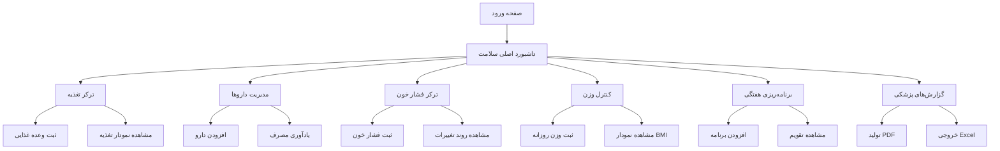

## 1. نمای کلی محصول
داشبورد سلامتی هوشمند با رابط کاربری جذاب و حرفه‌ای برای مدیریت جامع سلامت شخصی. این سیستم به کاربران کمک می‌کند تا تغذیه، داروها، فشار خون، وزن و برنامه‌های سلامتی خود را به صورت دقیق ردیابی و مدیریت کنند.

هدف اصلی: ایجاد یک مرکز کنترل سلامت دیجیتال با قابلیت گزارش‌دهی حرفه‌ای برای پزشکان و پیگیری پیشرفت سلامت در طول زمان.

## 2. ویژگی‌های اصلی

### 2.1 نقش‌های کاربری
| نقش | روش ایجاد حساب | دسترسی‌ها و مجوزها |
|------|---------------------|------------------|
| کاربر عادی | ثبت‌نام با ایمیل | دسترسی کامل به تمام ویژگی‌های سلامتی، ایجاد و مشاهده گزارش‌ها |
| کاربر ویژه | ارتقاء حساب | ذخیره‌سازی ابری، همگام‌سازی بین دستگاه‌ها، گزارش‌های پیشرفته |

### 2.2 ماژول‌های اصلی
داشبورد سلامتی شامل صفحات اصلی زیر است:

1. **داشبورد اصلی سلامت**: نمایش کلی وضعیت سلامت، نمودارهای پیشرفت، اطلاعات سریع
2. **ترکر تغذیه**: ثبت وعده‌های غذایی، محاسبه کالری، نمودار مصرف مواد غذایی
3. **مدیریت داروها**: ثبت داروها، یادآوری مصرف، تاریخچه مصرف
4. **ترکر فشار خون**: ثبت مقادیر سیستولیک و دیاستولیک، نمودار روند تغییرات
5. **کنترل وزن**: ثبت وزن روزانه، نمودار BMI، هدف‌گذاری کاهش/افزایش وزن
6. **برنامه‌ریزی هفتگی**: تقویم سلامتی، برنامه‌های ورزشی و غذایی
7. **گزارش‌های پزشکی**: خروجی PDF/Excel، نمودارهای جامع برای پزشک
8. **تنظیمات سلامت**: مدیریت اطلاعات پایه، اهداف شخصی

### 2.3 جزئیات صفحات

| نام صفحه | نام ماژول | توضیحات ویژگی |
|-----------|-------------|---------------------|
| داشبورد اصلی | کارت‌های سلامت | نمایش سریع وزن، فشار خون آخر، داروهای امروز، کالری مصرفی |
| داشبورد اصلی | نمودارهای پیشرفت | نمودار وزن 7 روز اخیر، روند فشار خون، نمودار BMI |
| داشبورد اصلی | یادآوری‌ها | نمایش داروهای امروز، وعده‌های غذایی، قرارهای پزشکی |
| ترکر تغذیه | ثبت وعده غذایی | افزودن غذا، جستجوی مواد غذایی، محاسبه خودکار کالری |
| ترکر تغذیه | تاریخچه مصرف | لیست وعده‌های روزانه، هفتگی، امکان ویرایش و حذف |
| ترکر تغذیه | نمودارهای تغذیه | نمودار مصرف کالری، پروتئین، کربوهیدرات، چربی |
| مدیریت داروها | افزودن دارو | نام دارو، دوز مصرفی، زمان مصرف، تکرار روزانه |
| مدیریت داروها | یادآوری مصرف | نوتیفیکیشن برای زمان مصرف، تأخیر و تکرار یادآوری |
| مدیریت داروها | تاریخچه مصرف | ثبت زمان مصرف هر دارو، نمایش وفاداری به درمان |
| ترکر فشار خون | ثبت اندازه‌گیری | سیستولیک، دیاستولیک، ضربان قلب، تاریخ و زمان |
| ترکر فشار خون | نمودار روند | نمودار خطی تغییرات، میانگین هفتگی و ماهانه |
| ترکر فشار خون | طبقه‌بندی | رنگ‌بندی بر اساس استانداردهای پزشکی WHO |
| کنترل وزن | ثبت وزن | وزن روزانه، تاریخ، نمایش تغییرات نسبت به روز قبل |
| کنترل وزن | نمودار پیشرفت | نمودار وزن در بازه‌های مختلف، نرخ تغییر |
| کنترل وزن | محاسبه BMI | محاسبه خودکار BMI، نمایش وضعیت وزنی |
| برنامه‌ریزی هفتگی | تقویم سلامت | مشاهده ماهانه، هفتگی، روزانه |
| برنامه‌ریزی هفتگی | افزودن برنامه | تعیین نوع (غذایی، ورزشی، دارویی)، زمان، تکرار |
| گزارش‌های پزشکی | خروجی PDF | گزارش جامع با نمودارها، قابل چاپ برای پزشک |
| گزارش‌های پزشکی | خروجی Excel | خروجی داده‌های خام برای تحلیل‌های پیشرفته |
| تنظیمات | اطلاعات پایه | قد، سن، جنسیت، سطح فعالیت، اهداف سلامتی |
| تنظیمات | مدیریت اهداف | هدف وزنی، هدف فشار خون، اهداف تغذیه‌ای |

## 3. فرآیندهای اصلی

### فرآیند کاربر عادی:
1. کاربر وارد داشبورد اصلی می‌شود
2. اطلاعات سلامت پایه (قد، وزن، فشار خون) را ثبت می‌کند
3. روزانه وزن و فشار خون را ثبت می‌کند
4. وعده‌های غذایی را ثبت می‌کند
5. داروها و زمان مصرف را تعریف می‌کند
6. از یادآوری‌ها برای مصرف داروها و وعده‌ها استفاده می‌کند
7. در بازه‌های زمانی گزارش‌های پزشکی تولید می‌کند

## 4. طراحی رابط کاربری

### 4.1 سبک طراحی
- **رنگ‌های اصلی**: سبز آرامش‌بخش (#10B981) برای سلامت، آبی روشن (#3B82F6) برای اطلاعات، سفید و خاکستری روشن برای پس‌زمینه
- **استایل دکمه‌ها**: گرد و شیک با سایه ملایم، hover effects نرم
- **فونت‌ها**: IranSans برای فارسی، سایز 14px برای متن اصلی، 16px برای عنوان‌ها
- **لایه‌بندی**: طراحی کارت‌محور با گردی‌های نرم و فضای خالی مناسب
- **آیکون‌ها**: آیکون‌های خطی ساده با رنگ‌های هماهنگ
- **انیمیشن‌ها**: انتقالات نرم 0.3s برای بهبود تجربه کاربری

### 4.2 طراحی صفحات
| نام صفحه | ماژول | عناصر رابط کاربری |
|-----------|-------------|-------------|
| داشبورد اصلی | کارت‌های سلامت | کارت‌های رنگی با آیکون‌ها، نمایش اعداد بزرگ، status indicators رنگی |
| داشبورد اصلی | نمودارها | نمودارهای خطی و دایره‌ای با رنگ‌های gradient، tooltip‌های تعاملی |
| ترکر تغذیه | فرم ثبت | اینپوت‌های جستجو با autocomplete، dropdown برای واحدها، دکمه‌های افزودن سبز |
| مدیریت داروها | لیست داروها | لیست کارت‌محور با زمان‌بندی، دکمه‌های ویرایش و حذف، indicator وضعیت مصرف |
| ترکر فشار خون | فرم اندازه‌گیری | اینپوت‌های عددی با اعتبارسنجی، دکمه ثبت آبی، نمایش وضعیت با رنگ‌بندی |
| کنترل وزن | نمودار وزن | نمودار خطی با نمایش هدف، محورهای واضح، gridlines کم‌رنگ |
| گزارش‌ها | دکمه‌های خروجی | دکمه‌های PDF قرمز، Excel سبز، preview قبل از دانلود |

### 4.3 واکنش‌گرایی
- **اولویت دسکتاپ**: طراحی برای صفحه‌های 1280px به بالا
- **سازگار با موبایل**: Responsive design برای 320px تا 768px
- **تبلت**: لایه‌بندی تطبیقی برای 768px تا 1024px
- **لمسی**: دکمه‌ها و عناصر تعاملی با سایز مناسب برای لمس انگشت
- **چرخش صفحه**: پشتیبانی از حالت افقی و عمودی در موبایل