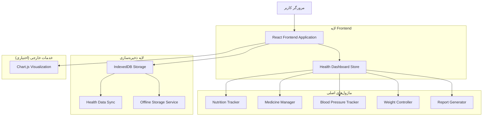
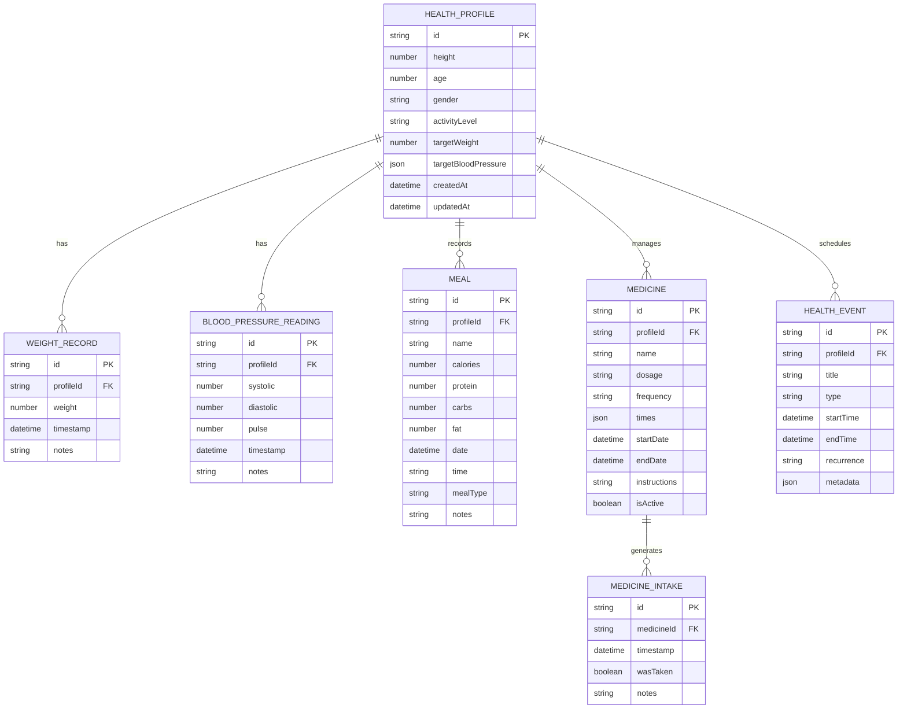

## 1. طراحی معماری



## 2. توضیح فناوری‌ها

- **Frontend**: React@18 + TypeScript + Vite
- **Styling**: TailwindCSS@3 + CSS Modules
- **State Management**: Zustand برای مدیریت state محلی
- **Charts**: Chart.js@4 + react-chartjs-2 برای نمودارهای پیشرفته
- **Storage**: IndexedDB برای ذخیره‌سازی آفلاین + idb برای مدیریت آسان
- **PDF Generation**: jspdf + html2canvas برای گزارش‌ها
- **Date Management**: date-fns برای مدیریت تاریخ‌ها
- **Form Validation**: React Hook Form + Zod برای اعتبارسنجی
- **Icons**: Lucide React برای آیکون‌های یکنواخت
- **Notifications**: Web Notifications API برای یادآوری‌ها

## 3. تعریف مسیرها

| مسیر | هدف |
|-------|---------|
| /health-dashboard | داشبورد اصلی سلامت - نمایش کلی وضعیت |
| /health-dashboard/nutrition | ترکر تغذیه - ثبت و مدیریت وعده‌های غذایی |
| /health-dashboard/medicines | مدیریت داروها - یادآوری و ثبت مصرف |
| /health-dashboard/blood-pressure | ترکر فشار خون - ثبت و نمایش روند تغییرات |
| /health-dashboard/weight | کنترل وزن - ثبت وزن و نمودار پیشرفت |
| /health-dashboard/planner | برنامه‌ریزی هفتگی - تقویم سلامتی |
| /health-dashboard/reports | گزارش‌ها - خروجی PDF و Excel |
| /health-dashboard/settings | تنظیمات - اطلاعات پایه و اهداف |

## 4. تعریف APIهای داخلی

### 4.1 سرویس‌های ذخیره‌سازی

```typescript
// Health Data Service
interface HealthDataService {
  // Nutrition
  addMeal(meal: Meal): Promise<void>
  getMeals(date: Date): Promise<Meal[]>
  updateMeal(id: string, meal: Partial<Meal>): Promise<void>
  deleteMeal(id: string): Promise<void>
  
  // Medicines
  addMedicine(medicine: Medicine): Promise<string>
  getMedicines(): Promise<Medicine[]>
  recordMedicineIntake(medicineId: string): Promise<void>
  getMedicineHistory(medicineId: string): Promise<MedicineIntake[]>
  
  // Blood Pressure
  addBloodPressureReading(reading: BloodPressureReading): Promise<void>
  getBloodPressureReadings(startDate: Date, endDate: Date): Promise<BloodPressureReading[]>
  getLatestBloodPressure(): Promise<BloodPressureReading | null>
  
  // Weight
  addWeightRecord(record: WeightRecord): Promise<void>
  getWeightRecords(startDate: Date, endDate: Date): Promise<WeightRecord[]>
  getLatestWeight(): Promise<WeightRecord | null>
  
  // Settings
  updateHealthProfile(profile: HealthProfile): Promise<void>
  getHealthProfile(): Promise<HealthProfile | null>
}
```

### 4.2 تایپ‌های داده اصلی

```typescript
// Nutrition Types
interface Meal {
  id: string
  name: string
  calories: number
  protein: number
  carbs: number
  fat: number
  date: Date
  time: string
  mealType: 'breakfast' | 'lunch' | 'dinner' | 'snack'
  notes?: string
}

// Medicine Types
interface Medicine {
  id: string
  name: string
  dosage: string
  frequency: 'daily' | 'twice' | 'three-times' | 'as-needed'
  times: string[]
  startDate: Date
  endDate?: Date
  instructions?: string
  isActive: boolean
}

interface MedicineIntake {
  id: string
  medicineId: string
  timestamp: Date
  wasTaken: boolean
  notes?: string
}

// Blood Pressure Types
interface BloodPressureReading {
  id: string
  systolic: number
  diastolic: number
  pulse: number
  timestamp: Date
  notes?: string
}

// Weight Types
interface WeightRecord {
  id: string
  weight: number
  timestamp: Date
  notes?: string
}

// Health Profile
interface HealthProfile {
  height: number
  age: number
  gender: 'male' | 'female'
  activityLevel: 'sedentary' | 'light' | 'moderate' | 'active' | 'very-active'
  targetWeight?: number
  targetBloodPressure?: {
    systolic: number
    diastolic: number
  }
}
```

## 5. ساختار پوشه‌ها

```
features/health-dashboard/
├── HealthDashboard.tsx          # کامپوننت اصلی داشبورد
├── components/
│   ├── HealthCards.tsx          # کارت‌های سلامت سریع
│   ├── ChartContainer.tsx       # کانتینر نمودارها
│   ├── NotificationBadge.tsx    # نشان‌دهنده یادآوری‌ها
│   └── ReportGenerator.tsx      # ژنراتور گزارش
├── nutrition/
│   ├── NutritionTracker.tsx     # ترکر تغذیه اصلی
│   ├── MealForm.tsx             # فرم ثبت وعده غذایی
│   ├── MealList.tsx             # لیست وعده‌ها
│   └── NutritionCharts.tsx      # نمودارهای تغذیه
├── medicines/
│   ├── MedicineManager.tsx      # مدیریت داروها
│   ├── MedicineForm.tsx         # فرم افزودن دارو
│   ├── MedicineList.tsx         # لیست داروها
│   └── MedicineReminder.tsx     # سیستم یادآوری
├── blood-pressure/
│   ├── BloodPressureTracker.tsx # ترکر فشار خون
│   ├── BPReadingForm.tsx        # فرم ثبت اندازه‌گیری
│   ├── BPChart.tsx              # نمودار فشار خون
│   └── BPAnalysis.tsx           # تحلیل مقادیر
├── weight/
│   ├── WeightTracker.tsx        # کنترل وزن
│   ├── WeightForm.tsx           # فرم ثبت وزن
│   ├── WeightChart.tsx          # نمودار وزن و BMI
│   └── WeightGoals.tsx          # هدف‌گذاری وزن
├── planner/
│   ├── HealthPlanner.tsx        # برنامه‌ریزی هفتگی
│   ├── CalendarView.tsx         # نمای تقویم
│   ├── EventForm.tsx            # فرم افزودن رویداد
│   └── WeeklySchedule.tsx       # برنامه هفتگی
├── reports/
│   ├── ReportDashboard.tsx       # داشبورد گزارش‌ها
│   ├── PDFGenerator.tsx         # ژنراتور PDF
│   ├── ExcelExporter.tsx        # خروجی Excel
│   └── ReportTemplates.tsx      # تمپلیت‌های گزارش
├── store/
│   ├── healthStore.ts           # استور اصلی سلامت
│   ├── nutritionStore.ts        # استور تغذیه
│   ├── medicineStore.ts         # استور داروها
│   └── reportStore.ts           # استور گزارش‌ها
├── types/
│   ├── health.types.ts          # تایپ‌های کلی سلامت
│   ├── nutrition.types.ts       # تایپ‌های تغذیه
│   ├── medicine.types.ts        # تایپ‌های داروها
│   └── chart.types.ts           # تایپ‌های نمودارها
├── utils/
│   ├── dateUtils.ts             # توابع تاریخ
│   ├── calculationUtils.ts      # محاسبات سلامت
│   ├── chartHelpers.ts          # کمک‌کننده‌های نمودار
│   └── reportHelpers.ts         # کمک‌کننده‌های گزارش
├── constants/
│   ├── healthConstants.ts       # ثابت‌های سلامت
│   ├── chartConfigs.ts          # تنظیمات نمودارها
│   └── notificationTexts.ts     # متن‌های یادآوری
└── services/
    ├── healthDataService.ts     # سرویس داده‌های سلامت
    ├── notificationService.ts    # سرویس نوتیفیکیشن
    └── reportService.ts         # سرویس گزارش‌گیری
```

## 6. مدل داده

### 6.1 طراحی Entity-Relationship



### 6.2 تعریف جدول‌های IndexedDB

```typescript
// IndexedDB Schema
const HEALTH_DB_CONFIG = {
  name: 'HealthDashboardDB',
  version: 1,
  stores: {
    healthProfile: {
      keyPath: 'id',
      indexes: ['createdAt', 'updatedAt']
    },
    weightRecords: {
      keyPath: 'id',
      indexes: ['profileId', 'timestamp']
    },
    bloodPressureReadings: {
      keyPath: 'id',
      indexes: ['profileId', 'timestamp']
    },
    meals: {
      keyPath: 'id',
      indexes: ['profileId', 'date', 'mealType']
    },
    medicines: {
      keyPath: 'id',
      indexes: ['profileId', 'isActive', 'startDate']
    },
    medicineIntakes: {
      keyPath: 'id',
      indexes: ['medicineId', 'timestamp']
    },
    healthEvents: {
      keyPath: 'id',
      indexes: ['profileId', 'startTime', 'type']
    }
  }
}
```

### 6.3 سرویس‌های اصلی

```typescript
// Health Data Service Implementation
class HealthDataService implements HealthDataService {
  private db: IDBPDatabase
  
  async initializeDB(): Promise<void> {
    this.db = await openDB(HEALTH_DB_CONFIG.name, HEALTH_DB_CONFIG.version, {
      upgrade(db) {
        // Create stores and indexes
        Object.entries(HEALTH_DB_CONFIG.stores).forEach(([storeName, config]) => {
          if (!db.objectStoreNames.contains(storeName)) {
            const store = db.createObjectStore(storeName, { keyPath: config.keyPath })
            // Create indexes
            config.indexes?.forEach(indexName => {
              store.createIndex(indexName, indexName)
            })
          }
        })
      }
    })
  }
  
  // Implementation methods for each data operation
  async addMeal(meal: Meal): Promise<void> {
    const tx = this.db.transaction('meals', 'readwrite')
    await tx.store.add(meal)
    await tx.done
  }
  
  async getMeals(date: Date): Promise<Meal[]> {
    const startOfDay = new Date(date.setHours(0, 0, 0, 0))
    const endOfDay = new Date(date.setHours(23, 59, 59, 999))
    
    return await this.db.getAllFromIndex(
      'meals',
      'date',
      startOfDay.toISOString(),
      endOfDay.toISOString()
    )
  }
  
  // ... other methods implementation
}
```

## 7. ویژگی‌های پیشرفته

### 7.1 سیستم یادآوری هوشمند
- یادآوری مصرف دارو بر اساس زمان تعیین‌شده
- یادآوری ثبت وزن روزانه در زمان مشخص
- یادآوری اندازه‌گیری فشار خون طبق برنامه
- نوتیفیکیشن‌های push در صورت پشتیبانی مرورگر

### 7.2 تحلیل‌های هوشمند
- تشخیص روند افزایش/کاهش وزن
- تحلیل تغییرات فشار خون و هشدار در صورت نیاز
- محاسبه وفاداری به مصرف داروها
- پیشنهادهای تغذیه‌ای بر اساس الگوهای مصرف

### 7.3 گزارش‌های پیشرفته
- گزارش هفتگی با نمودارهای ترکیبی
- گزارش ماهانه با تحلیل روندها
- گزارش سه‌ماهه برای پزشکان
- امکان سفارشی‌سازی بازه زمانی گزارش‌ها

### 7.4 همگام‌سازی ابری (اختیاری)
- همگام‌سازی داده‌ها با حساب کاربری
- پشتیبان‌گیری خودکار
- بازیابی داده‌ها در دستگاه‌های مختلف
- رمزنگاری داده‌های حساس قبل از ارسال